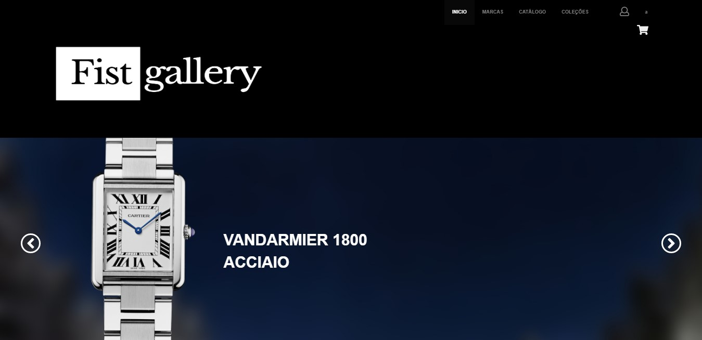
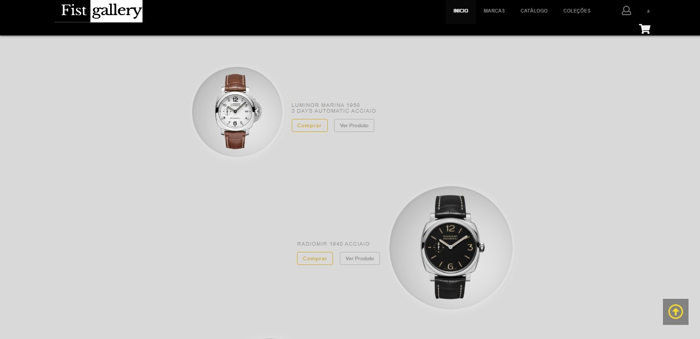
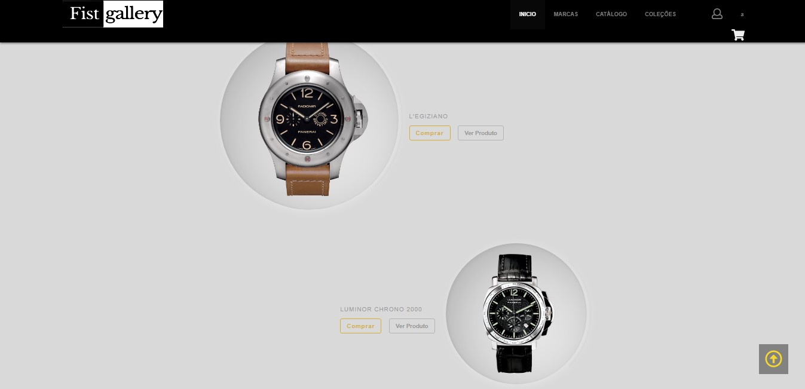
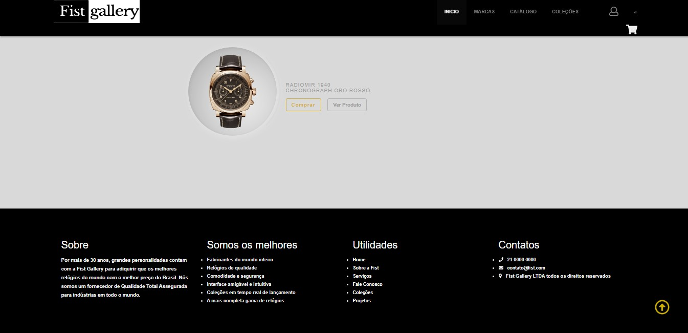
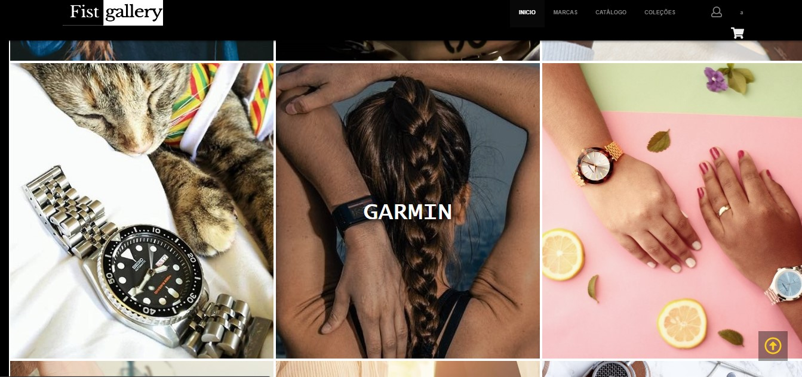
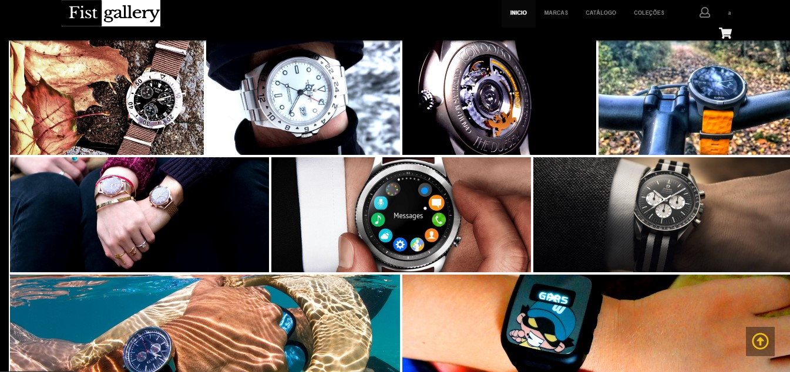
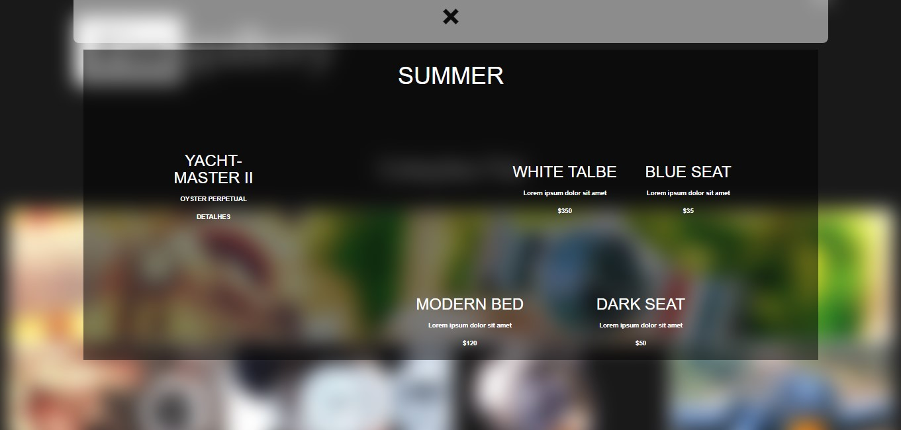
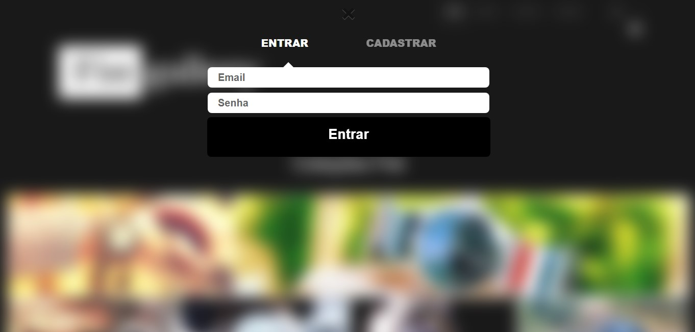
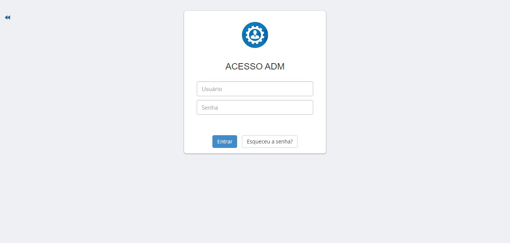
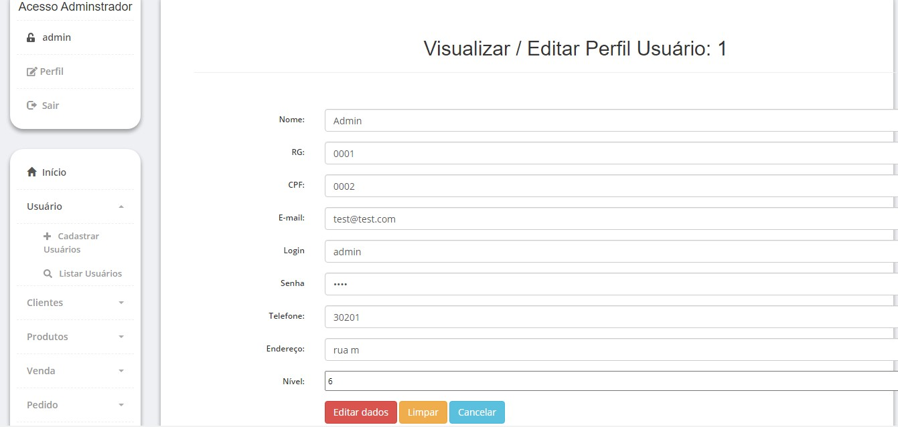

# Fist Gallery⌚
E-commerce de relojoaria

# Projeto💡

O projeto foi um trabalho técnico para conclusão de curso no Senac, chamado projeto integrador. A intenção era criar uma empresa fictícia
e desenvolver todo um e-commerce completo desde carrinho para clientes efetuarem conta como CRUD para o cliente que receberia o site editar os conteúdos do site.
A idéia foi que todo o conteúdo do site fosse dinâmico e que o usuário poderia alterá-lo quase que 100% do site apenas acessando um CRUD totalmente didádico.

# Skills👨‍💻

&nbsp;
&nbsp;
&nbsp;
&nbsp;
&nbsp;
&nbsp;
&nbsp;
&nbsp;
&nbsp;

# Examples

  
Desktop💻🖥

  
  
  
  
  
  
  
  
  
  
  
  

  
Mobile📱

  
  
  

